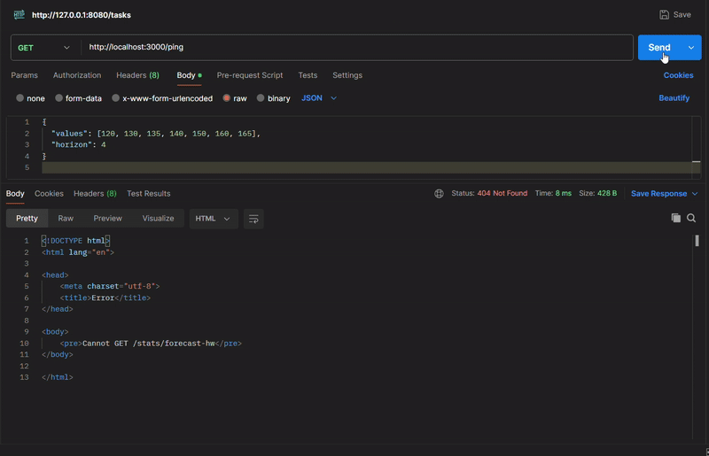

# Bring R's Statistical power to Javascript

This repo contains a simple `express js` app combined with `webR's` power to use R statistical function in the same project itself

## Forecast reponse from API request

